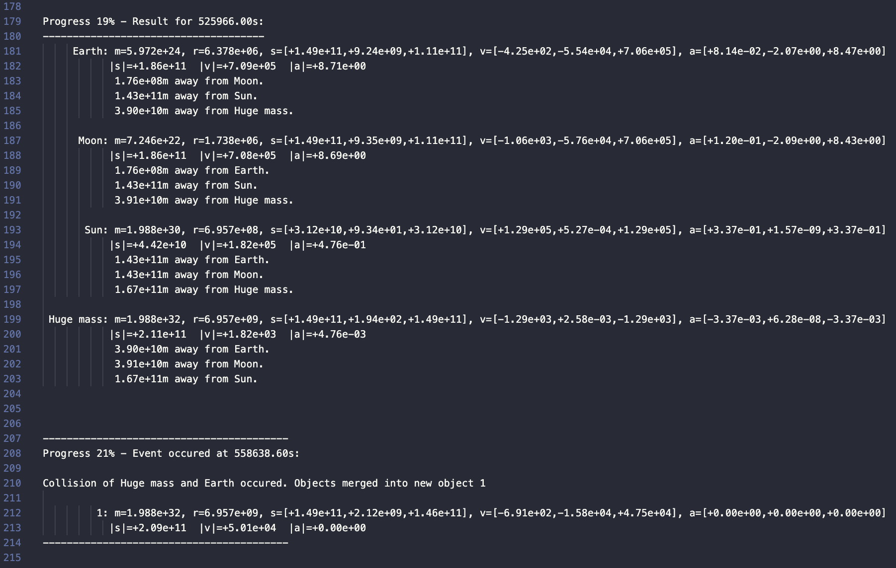

# Physics Simulator

In this private project I am creating a Physics Simulator in Java from scratch.

The simulator is currently used to simulate **gravity in a 3D space** and is capable of simulating the Sun-Earth-Moon system over a year with astounding precision within seconds of runtime.

The simulator comes with a variety of features including 
- extensive output/logging
- collision detection and handling
- easy and centralized customizability
- real-time mode

All documentation can be generated running `./javadoc.sh`.

Have a look into the `example.log` file or modify the `Sim.java` class and run the `run.zsh` script to generate your own simulation log in the logs folder. 

The current version is fully capable to simulate the collision and gravity segments of the Physics engine but no GUI has been implemented yet.
